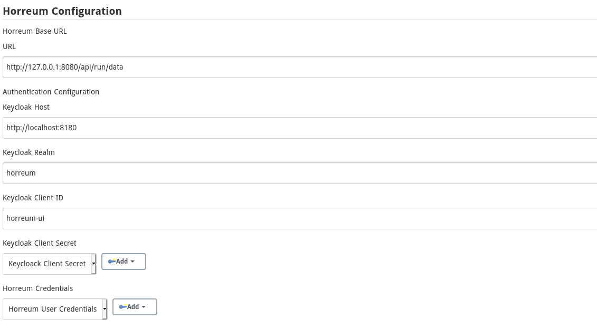

[[horreum-plugin]]
= Horreum Plugin
:toc: macro
:toc-title: Horreum Plugin ToC
ifdef::env-github[]
:tip-caption: :bulb:
:note-caption: :information_source:
:important-caption: :heavy_exclamation_mark:
:caution-caption: :fire:
:warning-caption: :warning:
endif::[]

toc::[]

[abstract]
.Overview
This plugin sends a JSON result object to a Horreum instance secured by Keycloak. The request is made as a job
execution in Jenkins and if the upload is unsuccessful, the job can be marked as failed
(configurable).

== Features

The following features are available in both Pipeline and traditional project types:

* Upload JSON result object to Horruem
* Supports Keycloak Authentication

=== Basic plugin features

=== Pipeline features

Example upload of `output.json` to Horreum instance

[source,groovy]
----
horreumUpload (
    credentials: 'dev-ci',
    test: 'Dummy Test',
    owner: 'dev-team',
    access: 'PUBLIC',
    start: '$.build-timestamp',
    stop: '$.build-timestamp',
    jsonFile: 'run/localhost/output.json'
)

----

You can access the response status code and content within a groovy script:

[source,groovy]
----
def response = horreumUpload (
    credentials: 'dev-ci',
    test: 'Dummy Test',
    owner: 'dev-team',
    access: 'PUBLIC',
    start: '$.build-timestamp',
    stop: '$.build-timestamp',
    jsonFile: 'run/localhost/output.json',
    abortOnfailure: false,
    quiet: false
)
println("Status: "+response.status)
println("Content: "+response.content)
----

== Building

The plugin can be built and tested locally using a Maven HPI:

[source, bash]
----
mvn hpi:run
----

== Configure Global Settings

